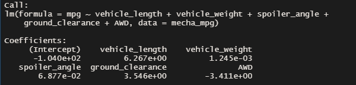
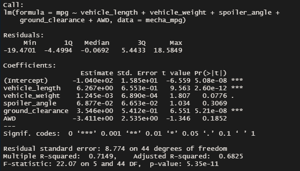
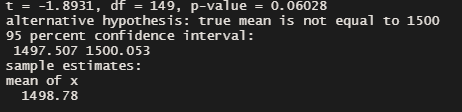
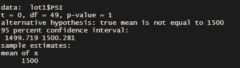
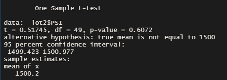
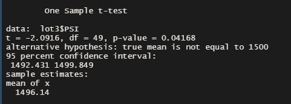

# MechaCar_Statistical_Analysis

 - Perform multiple linear regression analysis to identify which variables in the dataset predict the mpg of MechaCar prototypes
 - Collect summary statistics on the pounds per square inch (PSI) of the suspension coils from the manufacturing lots
 - Run t-tests to determine if the manufacturing lots are statistically different from the mean population
 - Design a statistical study to compare vehicle performance of the MechaCar vehicles against vehicles from other manufacturers. For each statistical analysis, you’ll write a summary interpretation of the findings.

## Linear Regression to Predict MPG

 - Which variables/coefficients provided a non-random amount of variance to the mpg values in the dataset?  
The variables in this data set that appear to have the most non-random effect on MPG are Ground Clearance and Vehicle Length.  In other words Ground Clearance and Vehicle Length seem to have the most significant impact on the MPG. The intercept value at 0.001 suggests there are factors not included in the dataset that also contribute to the MPG.

 - Is the slope of the linear model considered to be zero? Why or why not?  
The slope of the linear model is not considered to be zero, there is a significant relationship between 2 independent variables (Vehicle length and ground clearance) and the dependent variable (mpg).

 - Does this linear model predict mpg of MechaCar prototypes effectively? Why or why not?  
With a multiple R-squared value of 0.7149 the model predicts MPG effectively around 71.5% of the time. There are likely other factors not within this data set that could be included to make more accurate predictions.

## Summary Statistics on Suspension Coils

 - Does the current manufacturing data meet this design specification for all manufacturing lots in total and each lot individually? Why or why not? 
The design specifications for the MechaCar suspension coils dictate that the variance of the suspension coils must not exceed 100 pounds per square inch. Thus from the data provided, the entire population of the production lot the variance of the coils is 62.29 PSI and well within the 100 PSI variance requirement. However, while Lot1 and Lot2 are within the requirement with variances of 0.9796 and 7.4694 repectively, Lot3 is showing a variance of 170.2861 which is too large to meet the requirement.

## T-Tests on Suspension Coils

t-test results from all lots: 
 

From the previous output we can see the true mean of the sample is 1498.78 wich can be verified with the summary statistics in the previous section. With a p=Value of 0.06028 (higher than the common significance level of 0.05) ther is not enough evidence to support rejecting the null hypothesis. In other words the mean of all three of the lots is statistically similar to the population mean of 1500.

t-test results from lot1: 
 

Lot1 has a true sample mean of 1500 as with the summary statistics and a p-Value of 1. Therefore we can not reject the null hypothesis that there is no statistical difference between the assumed population mean of 1500 and the observed sample mean.

t-test results from lot2: 
 

Lot2 has an almost identical sample mean of 1500.2 and a p-Value of 0.61. The null hypthesis can not be rejected and the sample mean and population mean are statistically similar.

t-test results from lot3: 
 

Lot3 is diffrent from the previous lots. The sampe mean from lot3 is 1496.14 and the p-Value is 0.04 (lower than the common significance of 0.05). THis indicates a rejection of the null hypothesis that this sample mean and the presumed population mean are not statistically different.

## Study Design: MechaCar vs Competition

 - What metric or metrics are you going to test?
 - What is the null hypothesis or alternative hypothesis?
 - What statistical test would you use to test the hypothesis? And why?
 - What data is needed to run the statistical test?